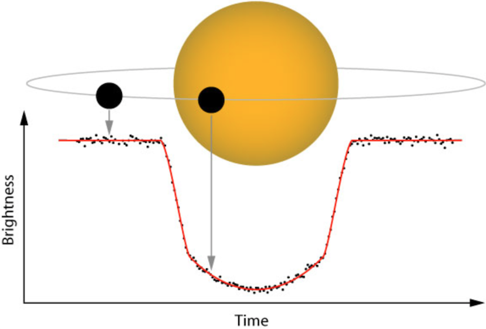
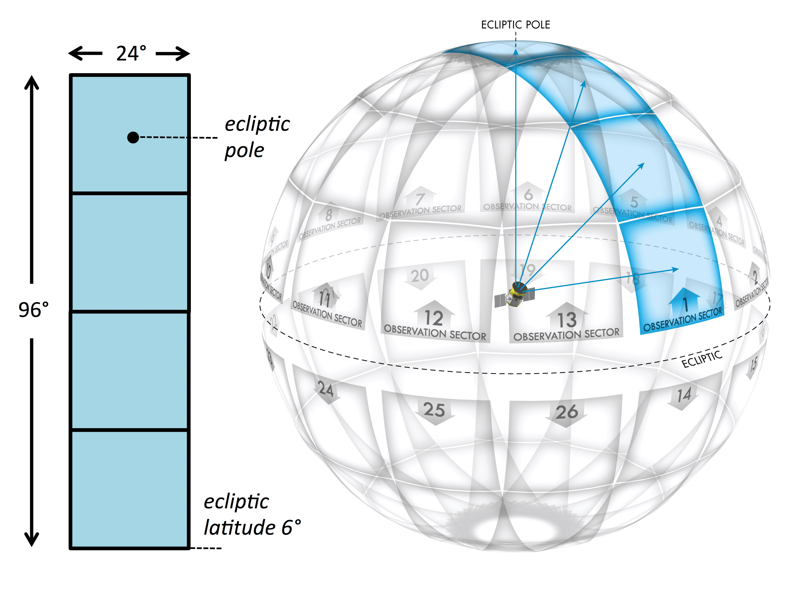

# Mamba-Exoplanet

> Selective State Space Models para detección de exoplanetas en curvas de luz de TESS, estudio comparativo frente a un baseline CNN 1D.

**Proyecto académico** Inteligencia Artificial, Instituto Tecnológico de Costa Rica, Semestre I 2026.
**Autores:** José Fabián Zumbado Ruiz, Jeremmy Aguilar Villanueva.
**Profesor:** Kenneth Obando Rodríguez.

## Objetivo

Evaluar si una arquitectura basada en **Mamba** (Gu & Dao, 2023) puede igualar o superar el rendimiento de clasificadores CNN 1D del estado del arte (familia AstroNet / ExoMiner) en la tarea binaria de distinguir **Confirmed Planets (CP)** de **False Positives (FP)** en curvas de luz de TESS a cadencia de 2 minutos, operando directamente sobre la señal cruda `PDCSAP_FLUX`.

Métricas objetivo: AUC-ROC ≥ 0.93, F1 (clase planeta) ≥ 0.85, mejora Mamba sobre CNN ≥ +3 p.p. de AUC, latencia de inferencia < 100 ms por estrella.

---

## Contexto: ¿de qué trata este proyecto?

> Para quien llega sin conocimiento previo de astronomía o ML.

---

### ¿Qué es un exoplaneta y cómo se detecta?

Un **exoplaneta** es un planeta que orbita una estrella distinta al Sol. No podemos fotografiarlos directamente, están demasiado lejos. Uno de los métodos indirectos más usados es el **método de tránsito**: cuando un planeta pasa por delante de su estrella desde nuestro punto de vista, tapa una pequeña fracción de la luz. El brillo de la estrella baja brevemente y luego vuelve a la normalidad.

```
Sin tránsito:  ─────────────────────────────
Con tránsito:  ───────────\____/───────────
```



Si ese bajón es pequeño, periódico y simétrico, hay evidencia de un planeta en órbita.

---

### ¿Qué es una curva de luz y por qué es la entrada del modelo?

Una **curva de luz** es la serie temporal del brillo de una estrella. TESS la mide cada 2 minutos durante ≈27 días por sector, produciendo una secuencia de ~18,000 puntos por estrella:

```
[1.0001, 0.9998, 1.0000, 0.9999, 0.9982, 0.9979, 0.9981, ...]
```

Esa secuencia es exactamente lo que recibe el modelo como input, sin ningún feature engineering adicional. La señal de tránsito es ese dip en los valores, apenas perceptible entre el ruido.

---

### ¿Qué son TESS y el TOI Catalog?

**TESS** (*Transiting Exoplanet Survey Satellite*, NASA, 2018) genera ≈27 GB de datos fotométricos por día observando más de 200,000 estrellas. Es imposible revisarlos a mano, de ahí la necesidad de clasificadores automáticos.

El **TOI Catalog** (*TESS Objects of Interest*) es la tabla pública donde la NASA registra cada candidato detectado por TESS. Cada estrella tiene un identificador único (**TIC ID**) y un estado:

| Estado | Significado | Uso en este proyecto |
|---|---|---|
| `CP` - Confirmed Planet | Planeta confirmado por revisión científica | **Clase positiva** (label = 1) |
| `FP` - False Positive | Señal descartada: binaria eclipsante, artefacto, etc. | **Clase negativa** (label = 0) |
| `PC` - Planet Candidate | Sin confirmación aún | Excluido del entrenamiento supervisado |
| `KP` - Known Planet | Planeta ya conocido de otras misiones | Excluido |

El dataset de este proyecto usa 724 CP y 1,242 FP (1,966 ejemplos etiquetados en total, conteo real al 2026-04-30).

TESS no observa el cielo completo a la vez: lo divide en regiones llamadas **sectores**, cada una observada durante ≈27 días. Una misma estrella puede aparecer en múltiples sectores, generando varias curvas de luz para el mismo TIC ID.



---

### Variables del TOI Catalog: cuales usamos y por que

El TOI Catalog tiene 85 columnas. **Ninguna entra al modelo como feature**: la entrada del modelo es siempre la serie temporal `PDCSAP_FLUX` de los archivos `.fits`. Las columnas del catálogo solo sirven para seleccionar qué estrellas descargar y con qué label.

**Variables que el pipeline usa activamente:**

| Columna | Para qué |
|---|---|
| `tid` | Identificador único de la estrella. Se usa para pedir los `.fits` a MAST y para hacer el split por estrella |
| `tfopwg_disp` | Disposición (CP, FP, PC, KP). Define el label: CP = 1, FP = 0 |
| `st_tmag` | Magnitud TESS. Estrellas con tmag > 15 tienen curvas muy ruidosas; se analiza en Fase 1 para decidir si hay que filtrar |
| `pl_orbper` | Periodo orbital en días. Confirma que el tránsito ocurre dentro de los 27 dias que cubre un sector (~18,000 puntos) |
| `pl_trandurh` | Duración del tránsito en horas. Confirma que la señal abarca suficientes puntos para ser detectable |
| `pl_trandep` | Profundidad del tránsito en ppm. Se analiza para entender si CP y FP tienen distribuciones distintas |
| `sectors` | Sectores en que fue observada la estrella. Informa cuántos `.fits` hay que descargar por TIC ID en Fase 2 |

**Por que se excluyen las otras 78 columnas:**

- Coordenadas y movimiento propio (`ra`, `dec`, `st_pmra`, `st_pmdec`, etc.): no tienen relacion causal con si una señal es planeta o falso positivo a efectos del modelo.
- Columnas de error (`*err1`, `*err2`, `*symerr`, `*lim`): metadatos de precisión de medición, irrelevantes para clasificación.
- Propiedades estelares (`st_teff`, `st_logg`, `st_rad`, `st_dist`): podrían usarse como features auxiliares en arquitecturas mas complejas, pero introducen riesgo de leakage y este proyecto evalua el modelo operando sobre señal cruda.
- Fechas y metadatos (`toi_created`, `rowupdate`, `release_date`, `toipfx`, `toidisplay`): administracion del catalogo, sin valor predictivo.

---

### Data leakage por estrella: la trampa mas común en este dominio

Una misma estrella puede haber sido observada por TESS en múltiples sectores, generando varias curvas de luz con el mismo TIC ID. Si al dividir los datos se mete el sector 1 de una estrella en entrenamiento y su sector 13 en test, el modelo puede aprender características propias de esa estrella (ruido estelar, variabilidad intrínseca) y hacer overfitting en el test. El resultado son métricas infladas que no reflejan generalización real. Por eso, el split se hace siempre por TIC ID, nunca por sector.

```
TIC 261136679 → train   (sectores 1, 2 y 13 van todos a train)
TIC 123456789 → test    (todos sus sectores van a test)
```

Ninguna estrella aparece en más de una partición.

---

## Estructura del repositorio

```
mamba-exoplanet/
├── configs/                # YAMLs por experimento (un archivo = un run reproducible)
├── data/
│   ├── raw/                # .fits descargados de MAST       (gitignored)
│   ├── processed/          # tensores listos para entrenar    (gitignored)
│   └── splits/             # TIC IDs de train/val/test        (versionado)
├── src/exoplanet/          # código fuente como paquete instalable
│   ├── data/               # descarga, preprocesamiento, Dataset, augment
│   ├── models/             # cnn_baseline.py, mamba.py
│   ├── training/           # loop, losses, schedulers
│   ├── evaluation/         # métricas, gráficos
│   └── utils/              # seeds, logging, paths
├── notebooks/              # exploración numerada (01_..., 02_..., 03_...)
├── scripts/                # CLIs reproducibles (download_data, train, evaluate)
├── experiments/            # outputs de cada run               (gitignored)
├── tests/                  # pytest
├── public/                 # imágenes para el README.md
└── paper/                  # LaTeX, figuras y tablas finales
```

## Instalación

**Requisitos previos:**

- Python **3.10 u 3.11** (probado con 3.11.9). Se recomienda la build oficial de [python.org](https://www.python.org/downloads/) sobre la versión de Microsoft Store, que a veces tiene problemas de permisos en `pip install -e`.
- Git Bash o PowerShell en Windows; bash en Linux/macOS.
- Aproximadamente **2.5 GB libres** en disco para el entorno completo (incluyendo PyTorch con CUDA).

> **Nota sobre OneDrive:** si el repositorio queda dentro de una carpeta sincronizada por OneDrive, mové el repo a una ruta local (p. ej. `C:\dev\mamba-exoplanet\`) **antes** de crear el `.venv`. OneDrive intenta sincronizar miles de archivos del entorno virtual y puede corromper binarios de PyTorch.

### Paso 1 - Clonar y posicionarse

```bash
git clone <url-del-repo> mamba-exoplanet
cd mamba-exoplanet
```

### Paso 2 - Crear y activar el entorno virtual

```bash
python -m venv .venv

# Activar - Git Bash en Windows:
source .venv/Scripts/activate
# Activar - PowerShell:
# .venv\Scripts\Activate.ps1
# Activar - Linux / macOS:
# source .venv/bin/activate
```

### Paso 3 - Instalar el paquete en modo editable

```bash
python -m pip install --upgrade pip
pip install -e ".[dev]"
```

Esto instala el paquete `exoplanet` y todas las dependencias declaradas en `pyproject.toml`, incluyendo `torch` (build **CPU** por defecto), `lightkurve`, `astropy`, `jupyterlab`, `pytest` y `ruff`.

### Paso 4 - Reinstalar PyTorch con CUDA (necesario para fases 5–9)

La build CPU de `torch` no usa la GPU. Para entrenar Mamba en la RTX 3050 hay que reemplazarla por la rueda CUDA. **Verificá primero la versión de CUDA de tu driver:**

```bash
nvidia-smi    # mirá "CUDA Version: XX.Y" en la esquina superior derecha
```

Luego desinstalá la build CPU e instalá la build que corresponde. Con driver 581+ (CUDA 13.0), usar la rueda CUDA 12.8:

```bash
pip uninstall -y torch
pip install torch --index-url https://download.pytorch.org/whl/cu128
```

Para otras versiones de CUDA, consultá <https://pytorch.org/get-started/locally/> y copiá el comando correspondiente.

Verificación de CUDA:

```bash
python -c "import torch; print('CUDA OK' if torch.cuda.is_available() else 'CPU only', '|', torch.cuda.get_device_name(0) if torch.cuda.is_available() else '')"
```

### Paso 5 - (Fases 8–9) Setup WSL2 para Mamba

`mamba-ssm` requiere compilar extensiones CUDA con `nvcc` y no tiene wheels pre-construidos para Windows nativo. **Decisión tomada: el modelo Mamba se desarrolla y entrena en WSL2 con Ubuntu.** Las fases 0–7 (exploración, preprocesamiento, CNN baseline) corren en Windows normalmente.

#### 5a - Activar WSL2 y Ubuntu (una sola vez, como administrador en PowerShell)

```powershell
wsl --install -d Ubuntu-24.04
# Reiniciar si el sistema lo pide, luego abrir Ubuntu desde el menú inicio
```

#### 5b - Instalar CUDA Toolkit en WSL2

```bash
# Dentro de Ubuntu WSL2:
wget https://developer.download.nvidia.com/compute/cuda/repos/ubuntu2404/x86_64/cuda-keyring_1.1-1_all.deb
sudo dpkg -i cuda-keyring_1.1-1_all.deb
sudo apt-get update
sudo apt-get -y install cuda-toolkit-12-8
```

Verificar que la GPU es visible:

```bash
nvidia-smi     # debe mostrar la RTX 3050 con CUDA 12.8
nvcc --version # debe mostrar release 12.8
```

#### 5c - Clonar el repo y crear entorno en WSL2

```bash
# Dentro de Ubuntu WSL2:
git clone <url-del-repo> ~/mamba-exoplanet
cd ~/mamba-exoplanet
python3.11 -m venv .venv
source .venv/bin/activate
pip install --upgrade pip
pip install -e ".[dev]"
pip uninstall -y torch
pip install torch --index-url https://download.pytorch.org/whl/cu128
```

#### 5d - Instalar mamba-ssm en WSL2

```bash
pip install causal-conv1d mamba-ssm
python -c "from mamba_ssm import Mamba; print('mamba-ssm OK')"
```

### Paso 6 - Verificación final

```bash
pytest -q                                                      # smoke tests deben pasar
python -c "import exoplanet; print(exoplanet.__version__)"     # → 0.1.0
python -c "import torch; print('CUDA OK' if torch.cuda.is_available() else 'CPU only', '|', torch.cuda.get_device_name(0) if torch.cuda.is_available() else '')"
python -c "import seaborn, tensorboard, einops, imbalanced_learn; print('deps extra OK')"
```

## Reproducir resultados (cuando estén disponibles)

```bash
python scripts/get_data.py --catalog data/splits/tics.csv
python scripts/train.py --config configs/cnn_baseline.yaml
python scripts/train.py --config configs/mamba_small.yaml
python scripts/evaluate.py --run experiments/<run_id>
```

## Entorno de referencia

Esta tabla documenta el entorno exacto usado para producir los resultados del paper. Es necesaria para reproducibilidad.

| Parámetro | Fases 0–7 (Windows) | Fase 8–9 (WSL2) |
|---|---|---|
| OS | Windows 11 Home 26200 | Ubuntu 24.04 en WSL2 |
| Python | 3.11.9 | 3.11.x |
| PyTorch | 2.11.0+cu128 | 2.11.0+cu128 |
| CUDA Toolkit | 12.8 (via wheel) | 12.8 (nvcc instalado) |
| GPU | NVIDIA RTX 3050 4 GB | NVIDIA RTX 3050 4 GB (via WSL2) |
| Driver NVIDIA | 581.83 | 581.83 |
| mamba-ssm | N/A | por determinar en Fase 8 |
| Commit hash | por completar al cierre | igual |
| Seeds globales | por definir en Fase 6 | igual |

> El commit hash y los seeds se fijan en Fase 6 y se copian al paper en Fase 10.

## Hardware de referencia

| Componente | Especificación |
|---|---|
| GPU | NVIDIA RTX 3050 (4 GB VRAM, cuello de botella) |
| CPU | Intel Core i5-12450H (8 cores, 12 threads) |
| RAM | 40 GB |

Las restricciones de VRAM motivan el uso de mixed precision (FP16), `batch_size = 16` y gradient checkpointing en Mamba.

## Roadmap

- [x] **Fase 0** - Setup del repositorio
- [ ] **Fase 1** - Exploración del TOI Catalog
- [ ] **Fase 2** - Pipeline de descarga (MAST + lightkurve)
- [ ] **Fase 3** - Preprocesamiento (normalización, NaN, longitud fija)
- [ ] **Fase 4** - Splits por TIC ID + `Dataset` PyTorch
- [ ] **Fase 5** - CNN 1D baseline
- [ ] **Fase 6** - Training loop (logs, seeds, checkpoints)
- [ ] **Fase 7** - Evaluación (métricas + curvas ROC/PR)
- [ ] **Fase 8** - Modelo Mamba
- [ ] **Fase 9** - Comparación rigurosa CNN vs Mamba
- [ ] **Fase 10** - Paper (figuras y tablas finales)

## Cita

```bibtex
@misc{zumbado_aguilar_2026,
    title       = {Mamba State Space Models for Exoplanet Detection in TESS Light Curves},
    author      = {Zumbado Ruiz, Jos\'e Fabi\'an and Aguilar Villanueva, Jeremmy},
    year        = {2026},
    institution = {Instituto Tecnol\'ogico de Costa Rica}
}
```

## Licencia

MIT. Ver `LICENSE` (pendiente).
